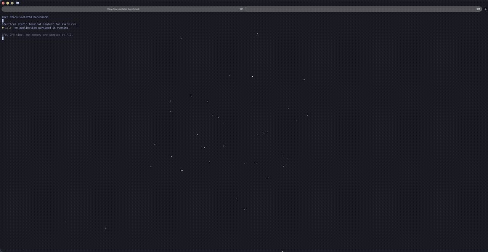

# Ghostty Warp Stars

A bright, point-only radial starfield shader for [Ghostty](https://ghostty.org/). Stars spawn throughout a circular zone, accelerate toward the viewer, and respawn at randomized positions.

It works in any Ghostty terminal and includes an optional configuration adjustment for [Herdr](https://herdr.dev/).



## Requirements

- Ghostty with custom-shader support
- A dark terminal theme is strongly recommended

This shader uses Ghostty's `iTime`, `iResolution`, and `iChannel0` shader inputs. Animation must remain enabled for continuous motion.

## Manual installation

Copy the shader:

```sh
mkdir -p ~/.config/ghostty/shaders
cp shaders/warp-stars.glsl ~/.config/ghostty/shaders/warp-stars.glsl
```

Add these lines to `~/.config/ghostty/config`:

```ini
custom-shader = /absolute/path/to/.config/ghostty/shaders/warp-stars.glsl
custom-shader-animation = always
```

Use the real absolute path for your machine. Validate the result:

```sh
ghostty +validate-config
```

Reload Ghostty:

- **macOS:** `Cmd+Shift+,`
- **Linux:** `Ctrl+Shift+,`

### Combining it with another shader

Ghostty accepts multiple `custom-shader` entries. They form an ordered shader pipeline. For example, the setup this project came from applies a cursor effect first and Warp Stars second:

```ini
custom-shader = /absolute/path/to/cursor_warp.glsl
custom-shader = /absolute/path/to/warp-stars.glsl
custom-shader-animation = always
```

The cursor shader is not included here. The original setup uses [ghostty-cursor-shaders](https://github.com/sahaj-b/ghostty-cursor-shaders).

## Herdr integration

Warp Stars does not require Herdr. To make Herdr panels use the terminal background, merge the following into `~/.config/herdr/config.toml`:

```toml
[theme.custom]
panel_bg = "reset"
```

If `[theme.custom]` already exists, add only the `panel_bg` entry rather than creating the table twice. Reload Herdr after editing:

```sh
herdr config check
herdr server reload-config
```

## Customization

The main controls are at the top of `shaders/warp-stars.glsl`:

| Constant | Default | Purpose |
| --- | ---: | --- |
| `WARP_SPEED` | `0.060` | Lifecycle and movement speed |
| `SPAWN_RADIUS` | `0.22` | Size of the randomized circular spawn zone |
| `STAR_BRIGHTNESS` | `1.38` | Overall additive brightness |
| `STAR_COUNT` | `44` | Number of simulated stars |
| `STAR_COLOR` | `(0.96, 0.98, 1.00)` | Blue-white point color |
| `BACKGROUND_LUMA_START` | `0.11` | Luminance where background masking starts |
| `BACKGROUND_LUMA_END` | `0.25` | Luminance above which pixels are protected |

After changing the shader, reload Ghostty. Recent Ghostty versions can hot-reload custom shader changes.

## How the effect works

Each star has a deterministic pseudo-random lifecycle:

1. A generation key chooses a fresh point inside the spawn circle.
2. A perspective depth value (`z`) decreases over time.
3. The projected travel distance uses `1 / z`, producing radial acceleration.
4. Point size and brightness increase slightly as the star approaches.
5. The star fades near its lifecycle boundaries and respawns with a new generation key.
6. The final star layer is added only to dark terminal pixels, preserving most text and UI elements.

No previous star position is sampled, which is why the effect produces no tail.

## Project layout

```text
ghostty-warp-stars/
├── assets/
│   └── demo.gif
├── examples/
│   ├── ghostty.conf
│   └── herdr.toml
├── shaders/
│   └── warp-stars.glsl
├── CONTRIBUTING.md
├── LICENSE
└── README.md
```

## Publishing

This folder is ready to become a Git repository:

```sh
git init -b main
git add .
git commit -m "Initial release"
```

Create an empty repository on your preferred host, add it as `origin`, and push `main`.

## License

MIT. See [`LICENSE`](LICENSE).
